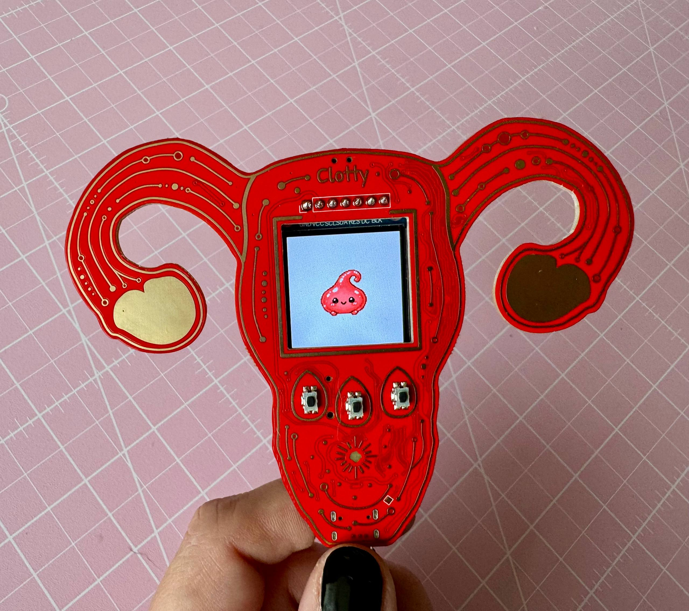
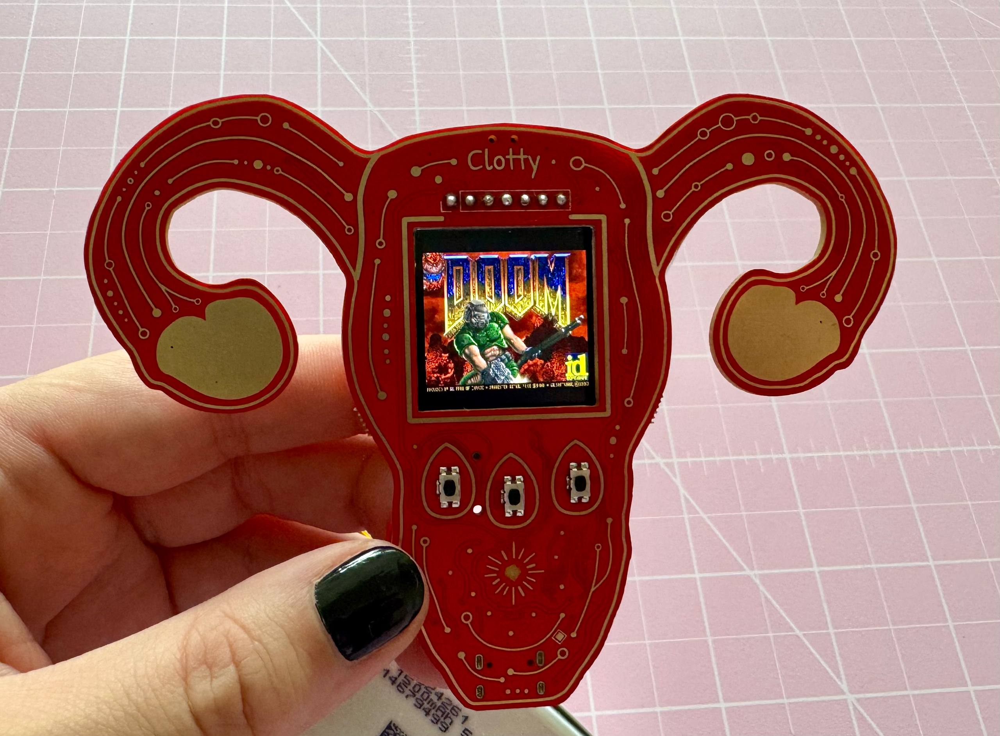
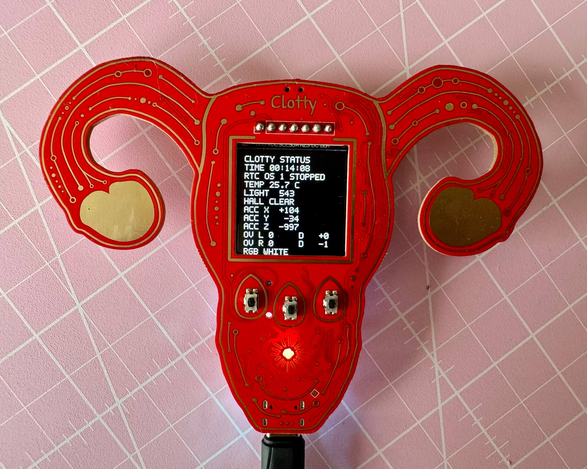
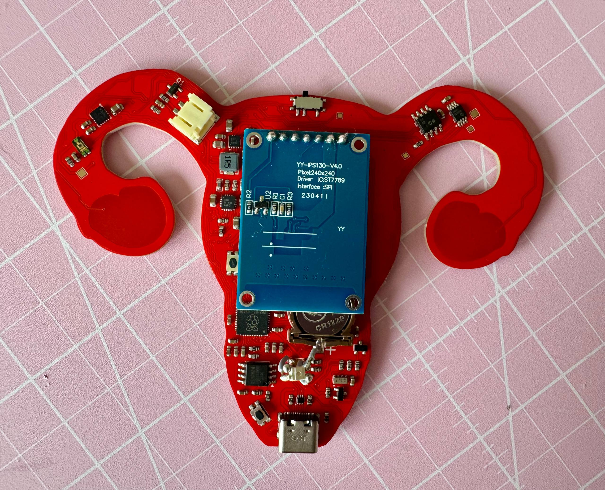
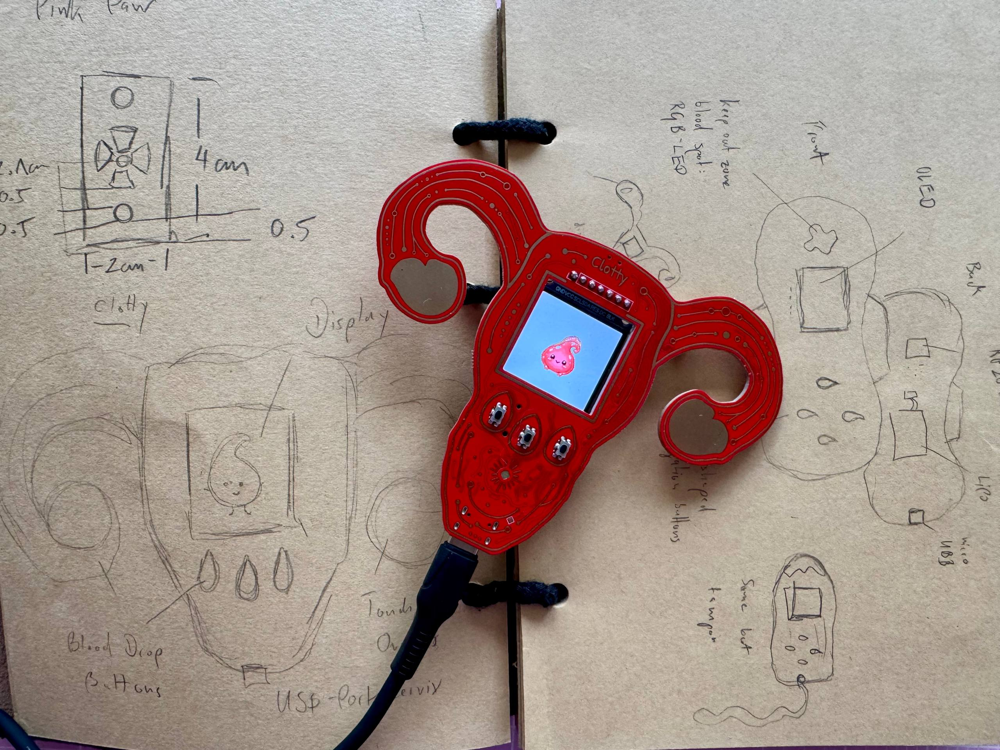

# Clotty

Clotty is a uterus-shaped RP2040 period-tracking companion, sensor board and tiny gaming device.

<p align="center">
  
  
</p>

## What is Clotty?

Clotty is a uterus-shaped, custom RP2040-based hybrid between a sensor board and a gaming device.

She originated from the wish to have an offline-only, privacy-focused period tracker that also happens to gamify the unpleasant, recurrent experience of, well, having a period.

Similar to a Tamagotchi, Clotty accompanies the user (currently: me) throughout the cycle. The goal is to keep her (and ideally myself) alive and happy, while her mood, constitution and little quests change according to the current cycle phase. Some of those quests interact with the physical environment through the board's sensors.

Clotty keeps track of cycle lengths and period dates, but she is **not a medical device** beyond that basic tracking functionality.

Naturally, she runs DOOM as well.

## Current Status

> [!WARNING]
> **Work in progress!**
>
> Clotty is currently at the **first working prototype** stage.
>
> Basic board functionality has been tested and confirmed, but there are known hardware issues and plenty of things I still want to improve.
>
> Please keep that in mind before having this revision fabricated.

Current (basic) bring-up status:

- RP2040 boots and can be flashed
- USB enumerates
- display works
- all three physical buttons work
- both capacitive-touch ovaries work
- temperature sensor works
- ambient-light sensor works
- accelerometer works
- Hall sensor works
- RTC works
- RGB LED works
- LiPo charging works
- basic battery-powered operation works
- DOOM runs
- nothing has exploded (yet)

However, testing is still ongoing! 

## Features

Clotty currently or eventually aims to provide:

- completely offline period tracking
- storage of previous cycle lengths and period dates
- basic prediction of likely future period dates
- cycle-phase-dependent moods
- cycle-phase-dependent quests
- cycle-phase-dependent profound wisdom (eg "everyone hates you" during luteal)
- sensor-based interactions with the environment
- small minigames
- animated Clotty sprites
- RGB cycle-phase indication (menacing menstruation maroon, friendly follicular fuchsia, overjoyed ovulation orchid, looming luteal lava...just examples)
- capacitive-touch ovaries for directional interaction
- battery-powered portable operation
- unreasonable amounts of tiny pixel-art accessories
- DOOM, obviously

## Hardware

Main hardware includes:

- **RP2040** microcontroller
- **W25Q128JVSIQ** 128 Mbit / 16 MiB QSPI flash
- **1.3" 240×240 IPS TFT**, driven by an ST7789
- **RV-8263-C7** real-time clock
- RGB LED
- three physical push buttons
- two capacitive-touch ovaries
- USB-C connector
- LiPo charging and power-management circuitry
- currently a 1,500mAh LiPo

<p align="center">
  
  
</p>

### Sensors

Clotty's sensor selection follows a very scientific design process largely based on "that would be kinda neat".

- **MCP9808-E/MS**: temperature
- **TEMT6000X01**: ambient light
- **LIS3DHTR**: 3-axis accelerometer
- **DRV5032FADBZR**: Hall-effect sensor
- **CAP1203**: capacitive-touch controller for the ovaries

Possible gameplay uses include things like warming Clotty up for a "hot water bottle" quest, putting her somewhere dark for a nap, moving around, or interacting with magnets for no particularly defensible reason.

### Display and Controls

Clotty uses a 240×240 IPS TFT driven by an ST7789.

Controls consist of:

- three physical push buttons
- capacitive-touch ovaries for left and right

The physical buttons are intended mainly for menu navigation and will eventually receive translucent red resin caps shaped like blood drops.

The ovaries are intended for directional or contextual interaction.

Yes, the ovaries also work as controls in DOOM.

### Power

Clotty is designed for portable LiPo-powered operation.

The board includes:

- USB-C input
- LiPo charging
- buck-boost conversion
- power-path / power-selection circuitry
- RTC backup battery

See the schematic for the exact implementation.

## Design

Primarily, the uterus-shape was chosen because it's a period tracking device and subtlety is not exactly my strength.
Periods and reproductive health are still stigmatised too often and Clotty's design is meant to help normalising a biological cycle thanks to which all of us are here in the first place.

But it also turns out that, for reasons nature most likely did not intend, a uterus is surprisingly game-controller-shaped.

The ovaries make convenient touch areas, the centre provides enough room for a display, and the overall shape sits well in the hands.

And yes, the USB-C connector is located at the cervix where it belongs.

<p align="center">
  
</p>

Earlier concepts included tampon-shaped and period-pad-shaped devices before the uterus eventually won.

## Known Issues

This revision is a prototype and has known mechanical and layout problems.

Known issues currently include:

- the LiPo JST connector is oriented badly and is difficult to use without brute-forcing the thing in
- the RTC backup battery holder makes the display sit further away from the PCB than intended
- there are currently no proper mounting holes for the planned enclosure (I kinda forgot)
- several component-placement and routing decisions deserve reconsideration (to put it politely)
- mechanical integration with the final case is still unfinished

The board works, but this revision should not be mistaken for a polished production design!

Hardware fixes and cleanup will happen on the `hw-devel` branch before being merged into `main`.

## Fabrication

Fabrication files are available in [`fabrication/`](fabrication/).

The directory contains:

- ready-to-upload Gerber archive
- unpacked Gerbers
- drill files
- JLCPCB BOM
- JLCPCB component-placement file

The current fabrication output corresponds to the prototype revision described above.

Again: **read the Known Issues section before ordering boards.**

## Building / Manufacturing

The project is designed in KiCad.

The repository contains:

- KiCad schematic
- KiCad PCB layout
- project-specific design rules
- local symbol libraries
- local footprint libraries
- artwork used for the PCB
- fabrication output
- schematic PDF

The local libraries are included so the project should not depend on random symbols and footprints disappearing from somewhere on the internet.

If you manufacture this board yourself, verify the BOM, footprints, component availability and fabrication files before ordering. Hardware is unforgiving and I am merely a person on the internet who likes putting USB ports into uteruses.

## Software

Clotty's main application software is still under development and is not yet part of a proper release.
But the firmware will appear in this repo, too.

The planned first usable version includes:

- date and time setup
- entering previous cycle dates / lengths
- entering the current period start date
- simple estimation of the next likely period
- cycle-phase tracking
- animated Clotty states
- small quests
- sensor interactions
- basic menu navigation

The software is deliberately not intended to perform medical analysis!

## DOOM

Clotty can run DOOM.

The DOOM build is based on [`kilograham/rp2040-doom`](https://github.com/kilograham/rp2040-doom).

My Clotty-specific fork lives here:

[`bitshiftcrazy/rp2040-doom`](https://github.com/bitshiftcrazy/rp2040-doom)

For Clotty I replaced the original Pico scanvideo output with a simple blocking SPI backend for the 240×240 ST7789 display and adapted the controls to use the physical buttons and capacitive-touch ovaries.

DOOM renders at 320×200 and is horizontally scaled to 240×200 for the display.

## Repository Structure

```text
.
├── artwork/              PCB artwork and source SVGs
├── docs/                 documentation and schematic PDF
├── fabrication/          Gerbers, BOM and placement files
├── libraries/            project-local KiCad symbols and footprints
├── pics/                 README images
├── clotty.kicad_dru      KiCad design rules
├── clotty.kicad_pcb      PCB layout
├── clotty.kicad_pro      KiCad project
├── clotty.kicad_sch      schematic
├── fp-lib-table
└── sym-lib-table
```

## Documentation

A PDF export of the current schematic can be found here:

[`docs/clotty.pdf`](docs/clotty.pdf)

The full KiCad project is available in the repository root.

More detailed project documentation, design background and development notes will also be published on my blog:

[missmolerat.com](https://missmolerat.com/)

## Roadmap

Roughly:

- fix JST placement
- improve RTC backup-battery placement
- add proper enclosure mounting points
- clean up placement and routing
- design the enclosure
- finish the first actual Clotty application
- add cycle-phase logic
- add quests and sensor interactions
- make far too many sprites
- design resin blood-drop button caps
- continue finding increasingly unnecessary things for a uterus to do

## License

- hardware design files: **CERN Open Hardware Licence Version 2 – Strongly Reciprocal (CERN-OHL-S-2.0)**
- original artwork and documentation: **CC BY-SA 4.0**

DOOM itself and the Clotty DOOM fork are not covered by the hardware licence of this repository.
